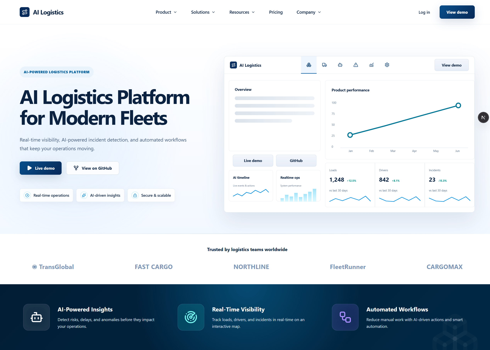

<div align="center">

# AI Logistics

### Intelligent fleet operations, from dispatch to incident response

Real-time visibility, AI-assisted insights, and automated workflows for modern
logistics teams.

[](https://github.com/aprydatko/ai-logistics/actions/workflows/ci.yml)


### [Open Live Demo](https://ai-logistics.prydatko.site)

</div>



## Overview

AI Logistics is a full-stack logistics operations platform built for teams that
need a single, reliable view of their fleet. It brings loads, drivers,
incidents, documents, notifications, and AI-assisted workflows into one
workspace.

The repository is organized as a strict TypeScript monorepo with a Next.js
product application, a NestJS API, shared domain contracts, and reusable UI
components.

## Platform Capabilities

- **Real-time operations** — monitor loads, drivers, assignments, and fleet
  activity from a centralized dashboard.
- **Incident management** — create, track, and resolve operational incidents
  with status and timeline history.
- **Driver management** — maintain driver profiles, vehicles, documents, and
  trip history.
- **AI-assisted workflows** — surface risks, operational suggestions, and
  auditable AI activity.
- **Document workflows** — review and manage logistics and driver documents.
- **Secure access** — authenticated routes, role-aware API policies, and
  refresh-token session recovery.
- **Operational reporting** — dashboards, metrics, notifications, and
  structured activity views.

## Technology

| Layer   | Technologies                                                |
| ------- | ----------------------------------------------------------- |
| Web     | Next.js 16, React 19, Tailwind CSS, TanStack Query, Zustand |
| API     | NestJS 11, Zod, class-validator, JWT                        |
| Data    | PostgreSQL 17, Drizzle ORM                                  |
| Shared  | TypeScript, workspace DTOs and domain types                 |
| Tooling | pnpm, Turborepo, ESLint, Prettier                           |
| Testing | Vitest, Testing Library, Playwright                         |
| CI      | GitHub Actions, coverage reports, JUnit test reports        |

## Architecture

```text
logistics-monorepo/
├── apps/
│   ├── api/                 # NestJS API and database access
│   └── web/                 # Next.js product application
├── packages/
│   ├── shared/              # Domain types and API DTOs
│   ├── ui/                  # Reusable React UI primitives
│   ├── eslint-config/       # Shared lint configuration
│   └── typescript-config/   # Shared TypeScript configuration
├── docs/                    # Architecture, testing, and feature guides
└── docker-compose.yml       # Local PostgreSQL service
```

Applications consume shared workspace packages. Shared packages remain
independent from application code, keeping domain contracts stable and
dependency direction explicit.

## Quick Start

### Prerequisites

- Node.js 18 or newer
- pnpm 9
- Docker with Docker Compose

### Run locally

```bash
git clone https://github.com/aprydatko/ai-logistics.git
cd ai-logistics

pnpm install
pnpm db:up
pnpm db:migrate
pnpm dev
```

The web application runs at [http://localhost:3000](http://localhost:3000).
PostgreSQL is exposed at `localhost:5432`.

Before starting the API, create `apps/api/.env` from the API environment
example and verify its database and authentication settings.

## Development Commands

| Command                 | Description                                      |
| ----------------------- | ------------------------------------------------ |
| `pnpm dev`              | Start all development services through Turborepo |
| `pnpm --filter web dev` | Start only the Next.js application               |
| `pnpm dev:api`          | Start only the NestJS API                        |
| `pnpm db:up`            | Start the local PostgreSQL container             |
| `pnpm db:migrate`       | Apply database migrations                        |
| `pnpm db:generate`      | Generate a Drizzle migration                     |
| `pnpm db:studio`        | Open Drizzle Studio                              |
| `pnpm db:logs`          | Follow PostgreSQL logs                           |
| `pnpm db:down`          | Stop local database services                     |

## Quality Checks

```bash
pnpm lint
pnpm check-types
pnpm build
pnpm format
```

Web test suites:

```bash
pnpm --filter web test
pnpm --filter web test:coverage
pnpm --filter web test:e2e
```

CI runs linting, type checks, unit tests with coverage, and Playwright E2E
tests. Failed browser runs publish Playwright reports, traces, screenshots, and
videos as workflow artifacts.

## Documentation

- [Architecture](docs/architecture.md)
- [Coding standards](docs/coding-standards.md)
- [Deployment](docs/deployment.md)
- [Testing and CI](docs/testing.md)
- [Driver domain and demo data](docs/drivers.md)
- [Code review checklist](docs/review-checklist.md)
- [Codex project instructions](AGENTS.md)

## Project Status

AI Logistics is under active development. APIs, shared contracts, and
user-facing workflows may continue to evolve as the operational feature set
expands.

## License

This project is available under the [MIT License](LICENSE). You are free to
use, modify, distribute, and build commercial projects with it, provided that
the original copyright and license notice are retained.
